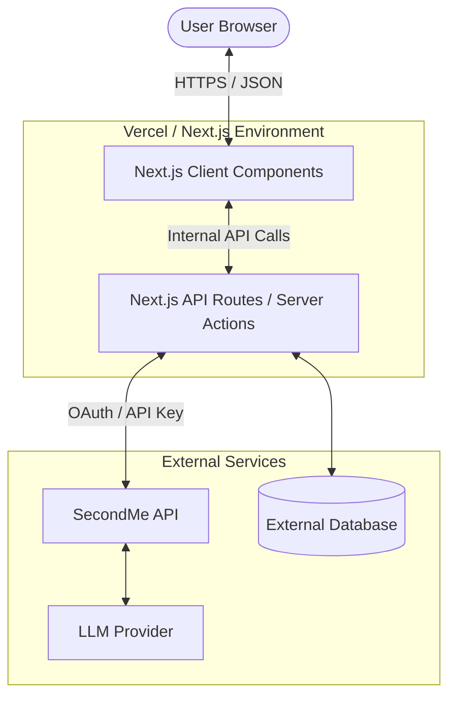

# System Architecture: SecondMe Avatar Client

## Overview
The SecondMe Avatar Client is a modern, glassmorphism-styled web application built with Next.js 16. It serves as a sophisticated interface for managing and interacting with personal AI avatars via the SecondMe platform. The system focuses on providing a seamless, real-time experience for chat, personality visualisation, and memory management.

The primary goal of this architecture is to provide a robust, responsive, and secure frontend client that leverages the SecondMe API. It acts as a bridge between the end-user and the complex AI models and memory systems managed by the SecondMe backend, offering a production-ready template for personalised AI interaction.

## Key Requirements
- **Performance**: High responsiveness and low latency in chat interactions and UI transitions.
- **Scalability**: Designed for horizontal scalability via Vercel's serverless infrastructure.
- **Security**: Secure handling of API credentials and user session data.
- **Visual Excellence**: Implementation of a custom glassmorphism design system using Tailwind CSS and Framer Motion.
- **Real-time Interaction**: Support for streaming responses and text-to-speech (TTS) output.
- **Maintainability**: Clear separation of concerns between UI components, API routes, and business logic.

## High-Level Architecture
The system follows a typical modern web architecture, utilising Next.js as both the frontend framework and the backend API proxy.

Underneath the hood, the user interacts with the **Next.js Client Components**, which communicate with the **Next.js API Routes**. These routes act as a secure proxy to the **SecondMe API**, ensuring sensitive credentials never reach the client side. The SecondMe platform handles the heavy lifting of LLM orchestration and memory persistence, while an optional application database can be used for client-specific metadata.

## Component Details

### Web Client (Next.js Frontend)
- **Responsibilities**: Rendering the glassmorphism UI, managing client-side state, handling Framer Motion animations, and processing Text-to-Speech output.
- **Main Technologies**: React, Next.js (App Router), Tailwind CSS, Framer Motion, Lucide React.
- **Communication**: Communicates with internal API routes via fetch.

### API Proxy (Next.js Server-side)
- **Responsibilities**: Securely proxying requests to the SecondMe API, handling authentication headers, and managing server-side business logic.
- **Main Technologies**: Next.js Server Actions, Route Handlers, TypeScript.
- **Communication**: HTTPS REST calls to SecondMe API and optional database connections.

### SecondMe API (External Integration)
- **Responsibilities**: Avatar personality management, conversational context handling, and memory retrieval/storage.
- **Communication**: Standardised REST API integrated via server-side secrets.

## Data Flow

### Chat Request Flow
1. User types a message in the **ChatInterface** component.
2. The client sends a POST request to `/api/secondme/chat`.
3. The server-side route attaches the `SECONDME_CLIENT_SECRET` and forwards the request to the SecondMe API.
4. The SecondMe API processes the request with the LLM and retrieves relevant memories.
5. The response (including reply text and metadata) is sent back through the proxy to the client.
6. The UI updates and triggers the TTS engine to speak the response if enabled.

### Memory Management Flow
1. User views or adds a memory via the **MemoryCard** or **Add Memory** form.
2. Data is sent to the server-side memory handler.
3. The handler syncs the memory state with the SecondMe API's "Soft Memory" or "Active Memory" systems.

## Data Model (High-Level)
- **Avatar**: Representation of the AI persona, including name, traits, and IDs.
- **Shade**: A personality trait or behavioural profile with confidence levels.
- **Memory**: An atomic piece of information (fact or conversational context) owned by the avatar.
- **UserSession**: Client-side session state for managing the active interaction.

## Infrastructure & Deployment
- **Platform**: Deployed on **Vercel** for optimal Next.js support.
- **Deployment Model**: Serverless functions for API routes and static generation for UI components.
- **CI/CD**: Automatic deployments from GitHub branches (main for production).

## Scalability & Reliability
- **Horizontal Scaling**: Handled automatically by the serverless architecture.
- **Resilience**: Client-side error boundaries and retry logic for API requests.
- **Performance**: Edge caching for static assets and optimised bundle sizes.

## Security & Compliance
- **Credential Safety**: Secrets (API keys, client secrets) are stored as environment variables and never exposed to the browser.
- **HTTPS**: All communication is encrypted in transit via TLS.
- **Authentication**: <ADD AUTHENTICATION DETAILS HERE, E.G. CLERK / NEXT-AUTH>.

## Observability
- **Logging**: Server-side logs via Vercel Runtime Logs.
- **Monitoring**: Performance monitoring via Vercel Speed Insights.
- **Error Tracking**: <ADD ERROR TRACKING TOOL HERE, E.G. SENTRY>.

## Trade-offs & Decisions
- **Decision**: Using Next.js API Routes as a proxy.
- **Reasoning**: To protect SecondMe API credentials while keeping the architecture simple and avoiding a separate backend service.
- **Trade-off**: Slightly higher latency due to the extra hop, but significantly better security and developer experience.

## Future Improvements
- Implementation of a dedicated cache layer (e.g., Redis) for frequent avatar metadata.
- Migration to Edge Runtime for faster API responses.
- Enhanced observability with comprehensive tracing and structured logging.
- Support for multi-tenant avatar workspaces.
